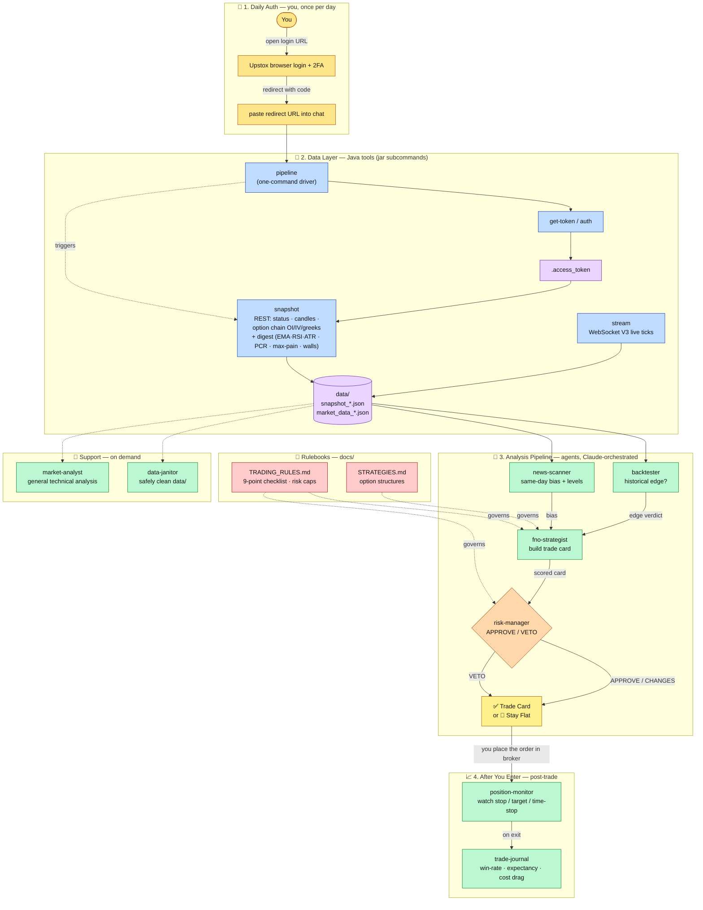

# WORKFLOW.md — System Diagram

The end-to-end workflow of the Live-Data F&O analysis app: auth → data → agent pipeline
→ gated trade card → post-trade management.

> **Viewing the diagram:** the Mermaid chart below renders automatically on GitHub and in
> VS Code with the *"Markdown Preview Mermaid Support"* extension (Ctrl+Shift+V to preview).
> An ASCII version follows for plain terminals.

## Flowchart (Mermaid)



## ASCII fallback

```
        YOU (browser login + 2FA, once/day)
                     │  paste redirect ?code=...
                     ▼
        ┌─────────────────────────────────────────┐
        │  DATA LAYER (Java jar subcommands)        │
        │  pipeline                                 │
        │     └─ get-token ─► .access_token         │
        │     └─ snapshot ───┐                       │
        │        stream ─────┴─► data/*.json         │
        └───────────────────────┬───────────────────┘
                                │  fresh data ready
                ┌───────────────┴───────────────┐
                ▼ (PARALLEL)                     ▼
        ┌──────────────┐                 ┌──────────────┐
        │ news-scanner │                 │  backtester  │
        │  -> bias     │                 │  -> edge?    │
        └──────┬───────┘                 └──────┬───────┘
               └───────────────┬────────────────┘
                               ▼     ◄── docs/TRADING_RULES.md
                       ┌──────────────┐  ◄── docs/STRATEGIES.md
                       │fno-strategist│
                       │ -> trade card│
                       └──────┬───────┘
                              ▼     ◄── docs/TRADING_RULES.md
                       ┌──────────────┐
                       │ risk-manager │  APPROVE / CHANGES / VETO
                       └──────┬───────┘
                              ▼
                  ✅ TRADE CARD  or  🛑 STAY FLAT
                              │  (you place the order)
                              ▼
                 position-monitor ──► trade-journal
                 (live stop/target)   (win-rate / expectancy)

   Support (any time): data-janitor (cleanup) · market-analyst (general TA)
```

## Legend
- 🟨 **Human step** (only you can do): browser login, and placing the actual order.
- 🟦 **Java tool** (deterministic; a subcommand of the built jar).
- 🟩 **Agent** (Claude-orchestrated reasoning).
- 🟪 **Data store** (`data/`, gitignored).
- 🟥 **Rulebook** (`docs/`) that governs the trade agents.
- 🟧 **Risk gate** — nothing becomes a "trade" without passing it.

Freshness is enforced at the data layer: if a snapshot is missing/stale, the pipeline stops
and refreshes before any agent analyses. See `docs/PIPELINE.md` for stage rules.